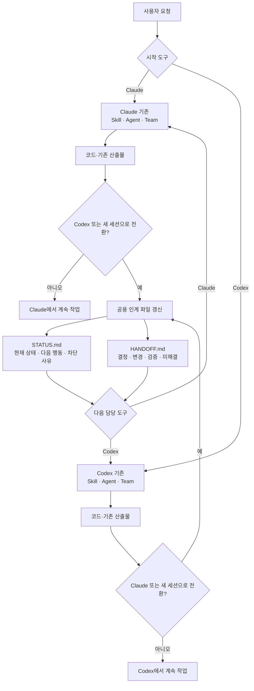
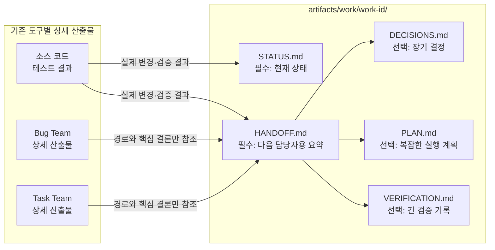
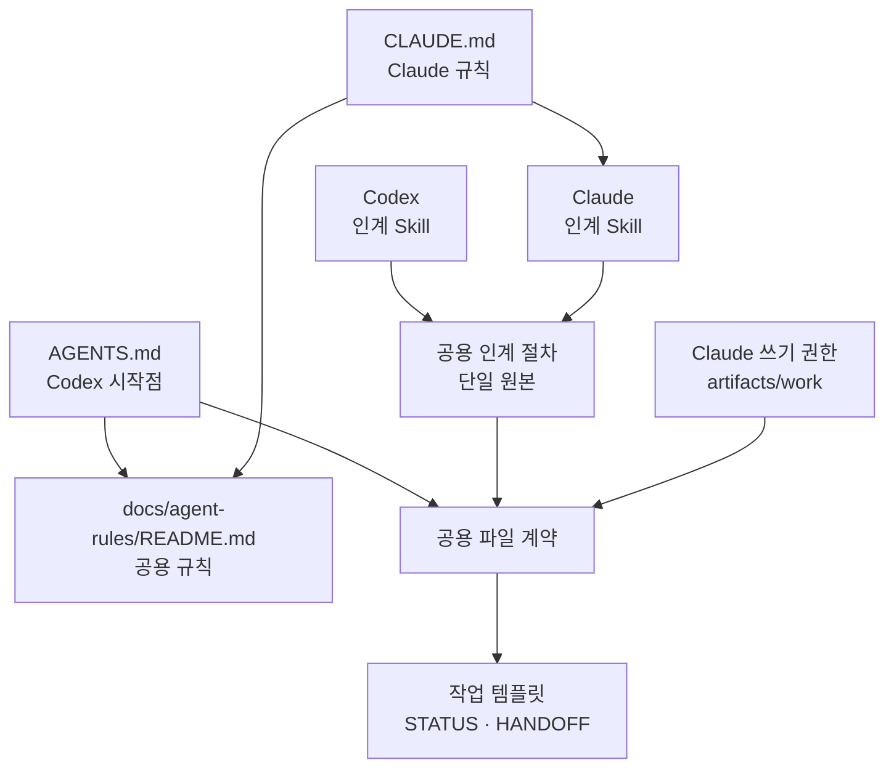

# Claude-Codex 공유 산출물 하네스

Claude와 Codex는 각 도구의 기존 Agent, Skill, Team 흐름으로 독립적으로 작업하고, 다른 도구 또는 새 세션이 실제로 이어받아야 할 때만 파일 기반 인계 계약을 사용한다.

## 목차

- [전체 흐름](#전체-흐름)
- [인계 시 읽고 쓰는 파일](#인계-시-읽고-쓰는-파일)
- [현재 diff의 역할](#현재-diff의-역할)
- [운영 규칙](#운영-규칙)

## 전체 흐름

## 인계 시 읽고 쓰는 파일

`task-team`과 `bug-team`의 내용을 공용 폴더에 복사하지 않는다. 다음 도구가 필요한 상세 문서만 `HANDOFF.md`에서 경로로 참조한다.

| 다이어그램 노드 | 실제 경로 또는 내용 |
| --- | --- |
| Task Team 상세 산출물 | `artifacts/task-team/`의 요구사항·명세·리뷰·QA |
| Bug Team 상세 산출물 | `artifacts/bug-team/`의 ticket·localize·fix·postmortem |
| 소스 코드·테스트 결과 | 현재 작업 트리의 변경과 실제 검증 결과 |

## 현재 diff의 역할

| 다이어그램 노드 | 실제 경로 |
| --- | --- |
| Codex 인계 Skill | `.agents/skills/cross-agent-handoff/SKILL.md` |
| Claude 인계 Skill | `.claude/skills/cross-agent-handoff/SKILL.md` |
| 공용 인계 절차 | `docs/agent-contracts/handoff.md` |
| 공용 파일 계약 | `artifacts/work/README.md` |
| 작업 템플릿 | `artifacts/work/work-item-template.md` |

## 운영 규칙

1. Claude와 Codex 중 어느 쪽에서 시작해도 동일하다.
2. 같은 도구와 세션에서 계속 작업하면 공용 인계 파일을 만들지 않는다.
3. 모델 또는 세션을 넘길 때만 `cross-agent-handoff`을 사용한다.
4. `STATUS.md`와 `HANDOFF.md`는 인계 시 필수다. 나머지 파일은 필요한 경우에만 추가한다.
5. 배포, 외부 발송, 삭제, 병합 충돌, 테스트 실패는 사람 승인 또는 명시적 미해결 상태로 남긴다.
